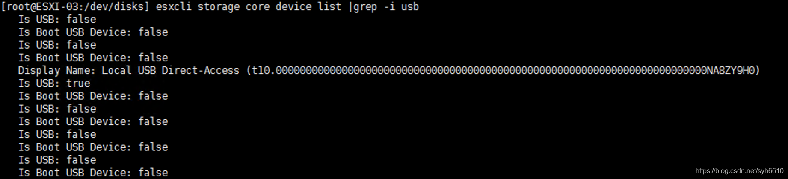
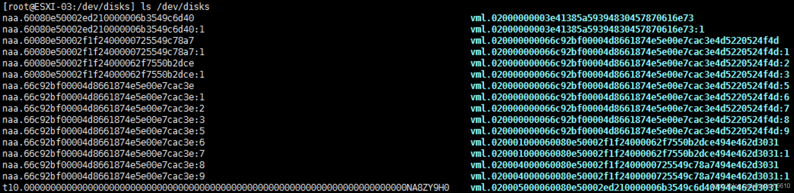
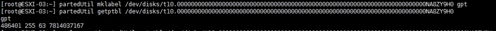
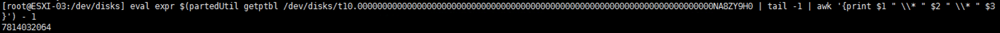
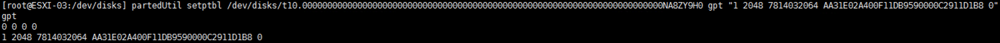
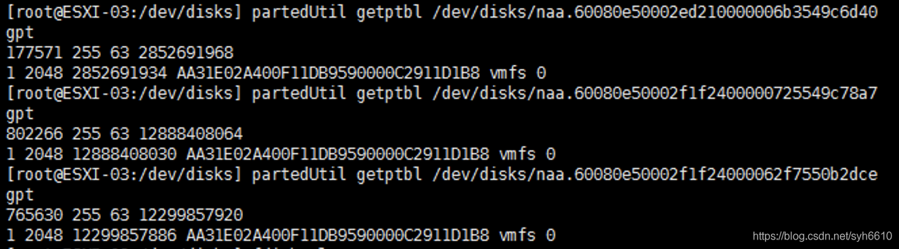
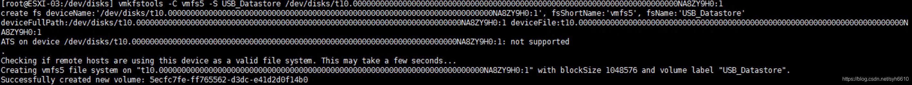
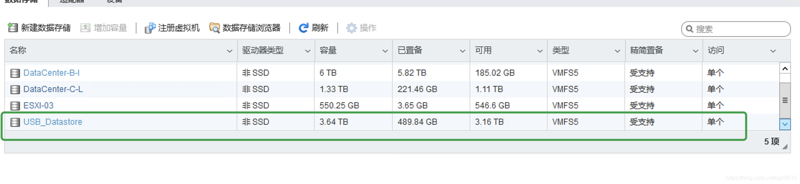

1. 进入ESXi单节点控制台开启ssh
2. 使用xshell或secureCRT等终端工具远程进入系统中。
   在不接入移动硬盘或U盘的情况下输入一下指令
   关闭usbarbitrator服务

```bash
/etc/init.d/usbarbitrator stop
```

1. 关闭usbarbitrator服务开机自启

```bash
chkconfig usbarbitrator off
```

1. 接入你的USB硬盘，查找usb存储设备，这时我们可以看到（Is USB:true）说明我们的usb硬盘已经被识别出来

```bash
esxcli storage core device list |grep -I usb
```



1. 输入以下命令，列出我们USB硬盘的信息,显示为（t10.000000000000000000000000000000000000000000000000000000000000000000000000NA8ZY9H0）这里的信息每个人的都不一样

```bash
ls /dev/disks/
```



1. 我们对移动存储设备进行采用gpt分区格式进行分区（格式分区会将设备进行格式化，建议使用没有重要数据的硬盘或者空盘来进行操作）

```bash
partedUtil mklabel /dev/disks/t10.000000000000000000000000000000000000000000000000000000000000000000000000NA8ZY9H0 gpt
```

1. 然后查看设置为gpt分区格式后的磁盘信息

```bash
partedUtil getptbl /dev/disks/t10.000000000000000000000000000000000000000000000000000000000000000000000000NA8ZY9H0
```



1. 接下来换算硬盘的二进制数值
   通过两种方式：
   第一种手动计算：用获得的gpt的3个值进行计算。公示为前三个数值相乘然后减1的到的结果，例如我的gpt格式下的值为486401 255 63
   换算成硬盘的二进制数值为486401*255*63-1=7814032064，做下记录，下面会用到。
   第二种方式通过命令行计算获得：

```bash
eval expr $(partedUtil getptbl /dev/disks/t10.000000000000000000000000000000000000000000000000000000000000000000000000NA8ZY9H0 | tail -1 | awk '{print $1 " \\* " $2 " \\* " $3
}') - 1
```

1. 磁盘名称更换成自己的名称再计算
   得到的结果也为
   7814032064
   
2. 下面在输入以下命令并修改为自己的硬盘数值来对硬盘进行分区，修改为你上一步换算出来的数值(7814032064)

```bash
partedUtil setptbl /dev/disks/t10.000000000000000000000000000000000000000000000000000000000000000000000000NA8ZY9H0 gpt "1 2048 7814032064 AA31E02A400F11DB9590000C2911D1B8 0"
```



1. 其中AA31E02A400F11DB9590000C2911D1B8此值为ESXi6.5的固定值，其他版本需要先查看默认的系统磁盘分区的值。由下图可以看到在ESXi6.5中的系统分区的都是此值。
   
2. 载我们USB硬盘,注意这里，不仅要换为你硬盘的数值，并且还要在后面加上分区号。

```bash
vmkfstools -C vmfs5 -S USB_Datastore /dev/disks/t10.000000000000000000000000000000000000000000000000000000000000000000000000NA8ZY9H0:1
```



1. 看到successfully说明已经挂在成功了，然后到此节点的控制台中打开存储可以看到已经将usb的存储设备添加到存储列表中了
   