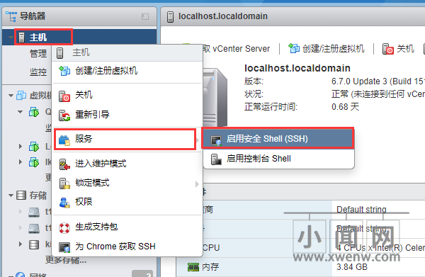
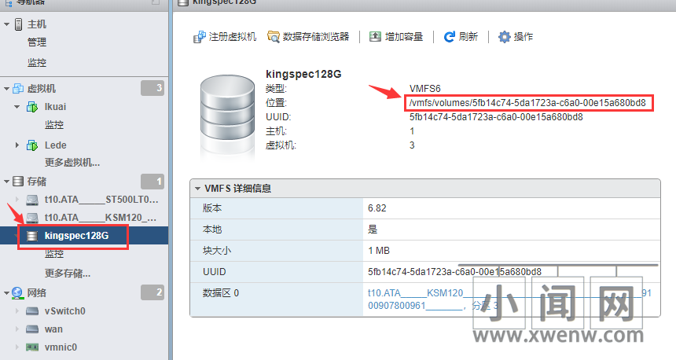
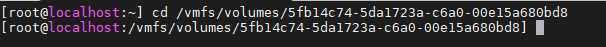
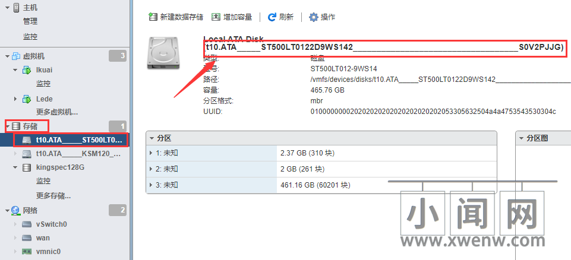
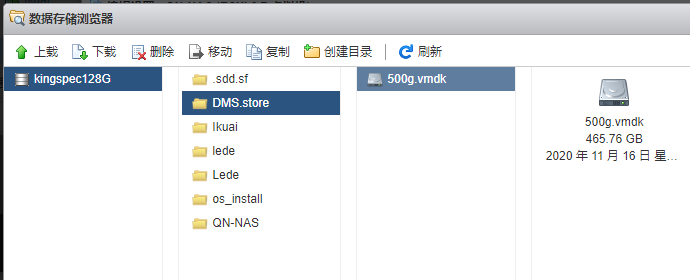
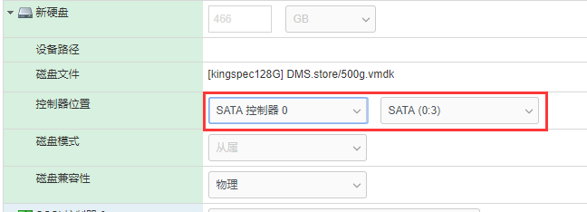

**这种方式优点也就是可以随意直通单个SATA，性能也可以达到虚拟硬盘的上限。如果您有直通SATA控制器的条件下，我们并不建议您采用此方式直通硬盘。因为它本质上依然是虚拟硬盘，只是用物理硬盘来模拟虚拟硬盘。对I/O来说还是有损耗的，并且会比直通SATA控制器的方式更加占用CPU性能一些。稳定程度也远不如直通SATA控制器，但总体上来说会比纯虚拟硬盘性能要强上不少。**

**1.进入ESXI6.7 web管理后台。开启SSH**



**2.点击存储，选择默认存储(ESXI安装硬盘)。复制位置地址备用；**



**3.打开SSH工具，登录SSH。登录以后执行以下命令。**

**执行命令1：**

```javascript
cd /vmfs/volumes/5fb14c74-5da1723a-c6a0-00e15a680bd8
```



/vmfs/volumes/5fb14c74-5da1723a-c6a0-00e15a680bd8 （是第二步复制备用的路径）

**执行命令2：**

```javascript
mkdir DSM.store
```

(这个命令是在默认存储空间根目录下创建一个用来存放直通镜像文件.vmdk的文件夹)

**4.复制准备直通的硬盘标识符** **t10.ATA_____ST500LT0122D9WS142___________________________________S0V2PJJG**



**执行如下命令：**

```javascript
vmkfstools -z /vmfs/devices/disks/t10.ATA_____ST500LT0122D9WS142___________________________________S0V2PJJG /vmfs/volumes/5fb14c74-5da1723a-c6a0-00e15a680bd8/DMS.store/500g.vmdk
```

**5.如果都正确执行的话，是不会弹出错误以及其他提示的。然后回到虚拟机设置，添加硬盘》添加现有硬盘》选择之前创建的直通磁盘vmdk文件。**



**6.设置相关参数，控制器选择STAT控制器，点击保存，**



**7.启动虚拟机，至此。直通硬盘给群晖虚拟机完成。**


